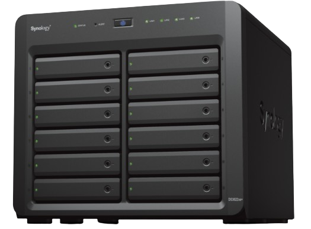

# wake-on-lan-server

einfach runterladen und auf den Webserver kopieren
die Dateien ubuntu-srv.php und nas.php abändern (richtige Subnetmask + richtige MAC-Adresse des Gerätes)
es können unendlich viele Geräte mit dem Server gestartet werden (es muss für jedes Gerät das gestartet werden soll eine eigene .php Datei erstellt werden)
Dann muss man nur noch das Skript in die index.html einfügen.
Einfach das hier kopieren in die index.html einfügen, dann nur noch abändern. (unter die anderen Codesnipsel, innerhalb des center tags bleiben!) Beispiel siehe hier: https://github.com/MaierTV/wake-on-lan-server-with-python/blob/main/index.html
         
         
         <h2>NAS</h2>
         <h1>192.168.2.3</h1>
         
               
